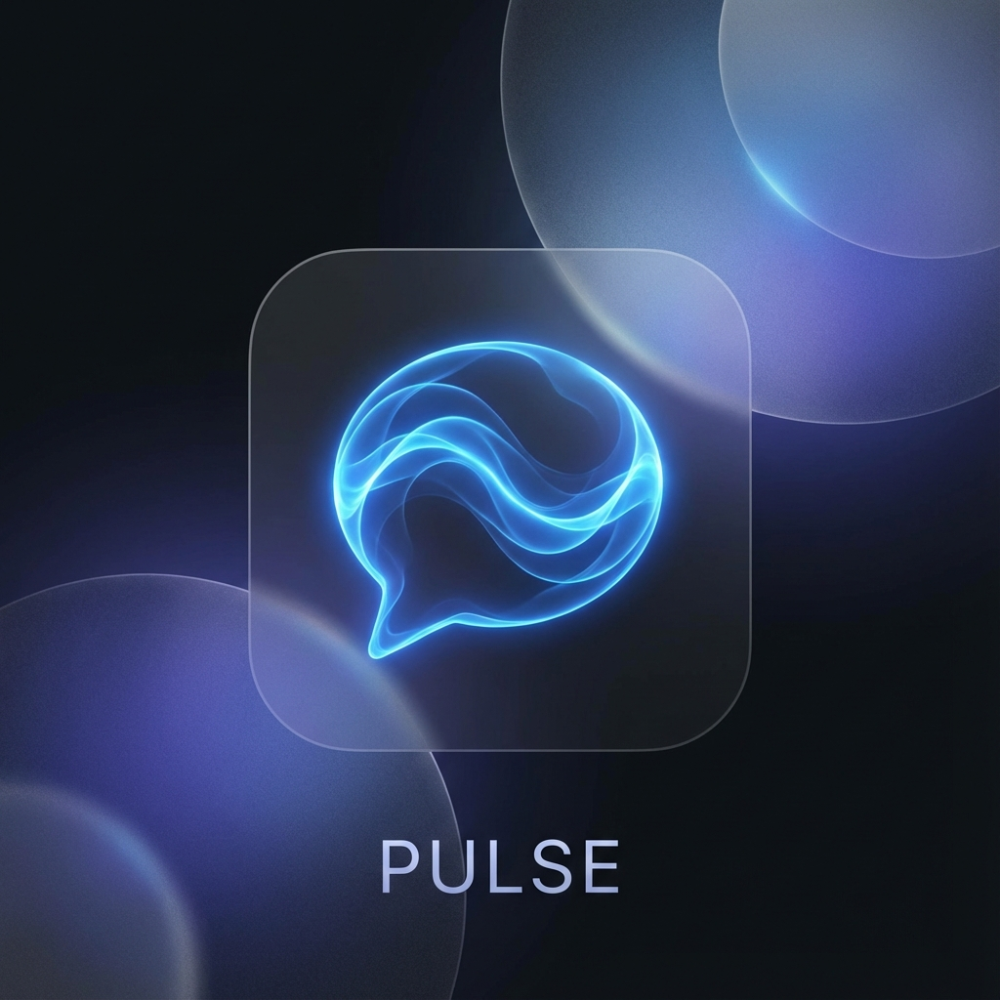
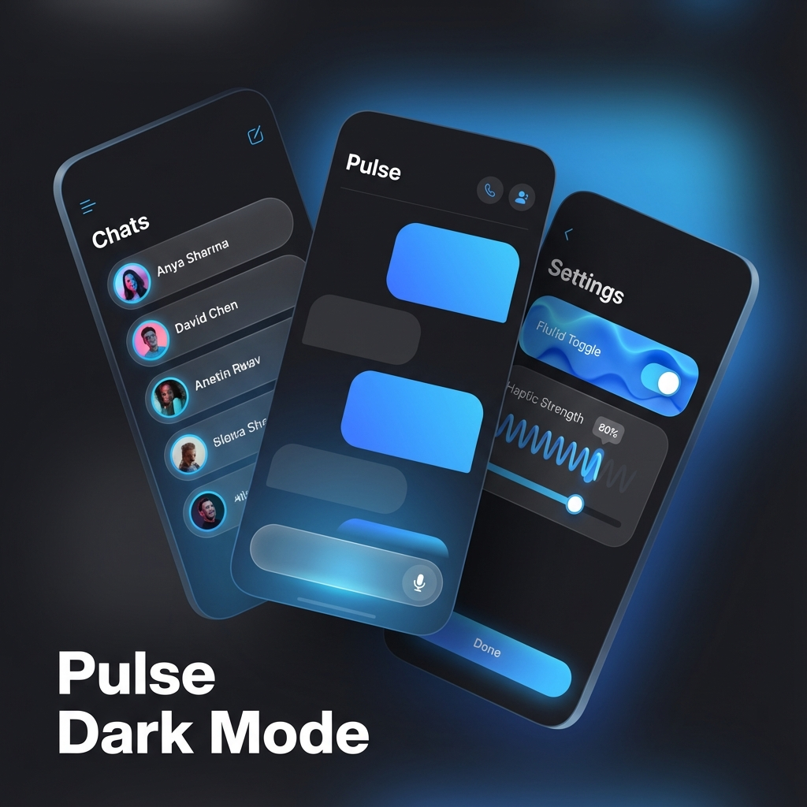

#  Pulse – Real-Time Communication UI Playground

Pulse is a performance-focused iOS communication UI playground built on industry-leading engineering standards. It demonstrates a senior-level architecture based on **Controller-State-Node** separation and custom physics animations.

## 📖 Documentation Portal
For a detailed architectural deep-dive, system design diagrams, and the official audit report, visit our:
👉 **[Pulse Technical Documentation Portal](docs/index.html)**
<br/><br/>


## 🚀 Key Features
- **Node-Based Rendering**: Lightweight `UIView` subclasses with manual layout for maximum performance.
- **Physics Animation Engine**: Custom `SpringAnimator` and `HighlightAnimator` mimic high-end interactive feel.
- **Predictable State Flow**: Strict downward state propagation and upward event handling.
- **CI Ready**: Integrated GitHub Actions workflow for build verification.

## 🏗 Architecture
Pulse follows the core principles used in high-performance, large-scale iOS applications:
1. **Controllers**: Manage business logic and state.
2. **State**: Immutable descriptions of the UI.
3. **Nodes**: Passive rendering components.
4. **Events**: Decoupled interactions.

## 📦 Project Structure
- `App/`: Application entry and root coordination.
- `Animation/`: Custom physics-based animation modules.
- `Components/`: Reusable primitive and composite UI nodes.
- `Infrastructure/`: Base protocols and performance monitoring tools.
- `Screens/`: Major feature modules (Chat List, Chat, Settings).

## 🛠 Building
The project is configured as a Swift Package for easy build verification.
```bash
swift build
```
For iOS specific verification:
```bash
xcodebuild -scheme Pulse -destination 'platform=iOS Simulator,name=iPhone 15' build
```

---
*Created as part of architectural research and UI system design.*
